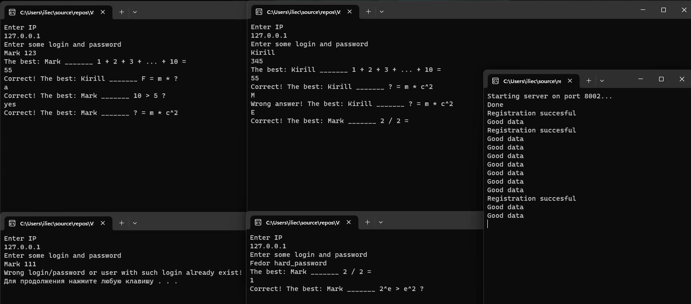

# Some Quiz
Some quiz using client to answer and server to calculate results

# Requirements

1) CMake
2) Boost

# Installation

1) Clone this source
2) CMake : Configure
3) CMake : Build
4) CMake : Install
5) Run binaries for server and for some clients from "Some Quiz/bin" folder
